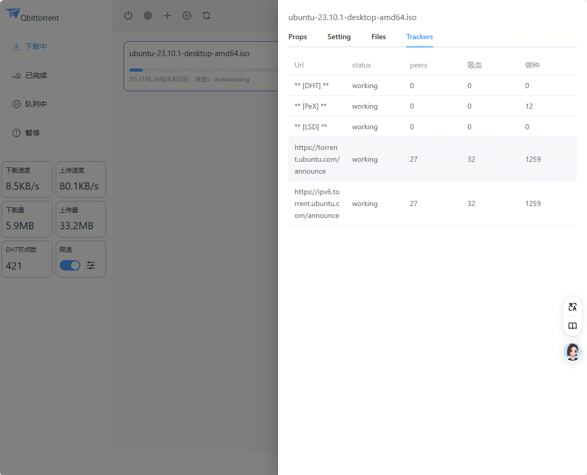
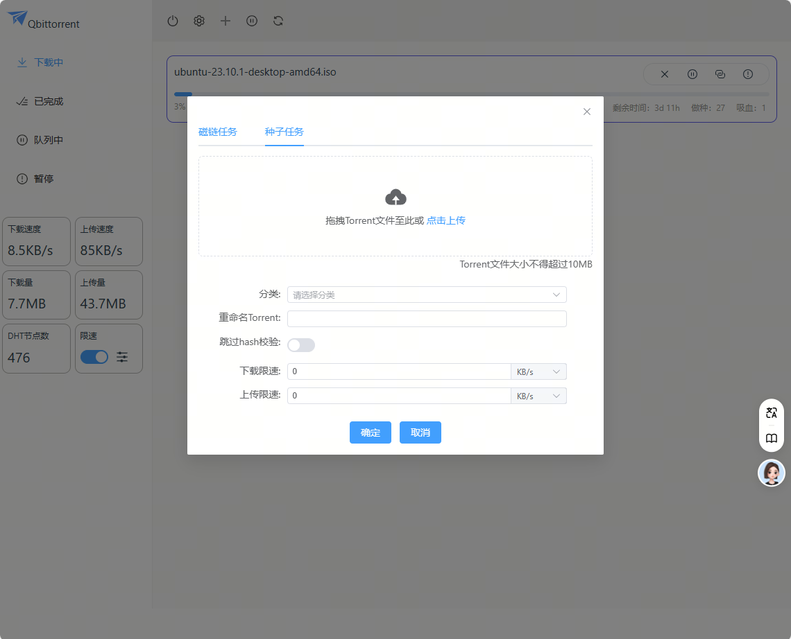

# QbtUI

The sleekest looking WebUI for qBittorrent made with Vue.js!
使用Vue3 开发的一个Qbittorrent WebUI界面, 参考了Motrix的界面。


  

 
 
[](.github/CODE_OF_CONDUCT.md)

## Screenshots 页面截图

- Login 登录页面
  
- Home 首页
  
- TorrentDetail 详情
  
  
  
  
- AddTorrent 添加弹窗页
  ]
  ]
- Settings 设置页
  ]

## Install 安装

1. 先下载本项目的最新版本Release包dist.zip
2. 解压后放在qBittorrent的电脑所有的目录下， 我是放在linux的 `/dist` 目录中
3. 打开Qbittorrent的设置页面，找到备用WebUI设置选项， 填入`/dist`后点击保存， 刷新即可
   

## Project Setup  项目编译

```sh
npm install
```

### Compile and Hot-Reload for Development

```sh
npm run dev
```

### Build Only

由于不太熟悉TypeScript, 所以打包的时候不做类型检查了。

```sh
npm run build-only  
```

### Lint with [ESLint](https://eslint.org/)

```sh
npm run lint
```


## 使用到的npm包
* Node.js NPM
* Vue3
* Element-Plus
* Axios
* Vue-Router（虽然加入了但是没有用到）
* Pinia
* qs

有问题欢迎提Issue  
